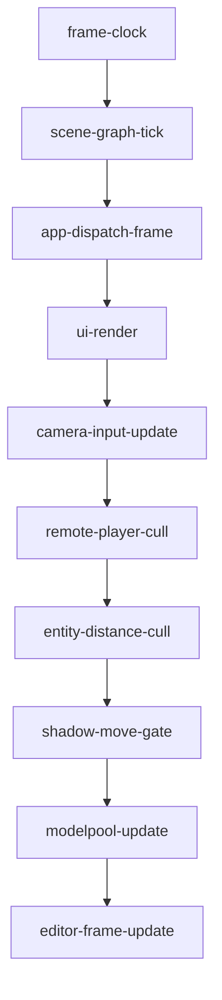
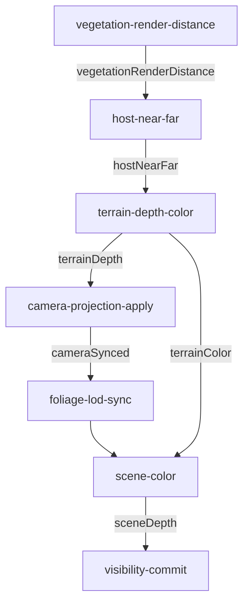

# Spoint Engine Graph

The single map of the client engine: every per-frame pass, every subsystem, and the cross-system seams
that used to be implicit. Read this first to understand the codebase; it is meant to make the whole render
+ optimization pipeline legible in one place so nothing is confusing.

> Derivable from code. The two graphs below mirror `client/core/RenderGraph.nodes.js` (render section) and
> the `buildFrameSectionNodes()` in `client/app.js` (frame section). The live render DAG is always available
> in the browser console as `window.__renderGraph.toMermaid()`, and per-node timing via
> `window.__renderGraph.stats()`. The control knobs are `window.__renderControls.list()`.

---

## Per-frame execution: two graphs, run in order

Each frame `animate()` runs **two** `RenderGraph`s in sequence. A `RenderGraph` is a DAG of nodes; each
node declares the resource keys it `reads` and `writes`, exactly one node may write a key (enforced with a
throw at construction — this is what makes a rogue 4th depth-compositing path *structurally impossible*),
edges derive from those reads/writes, and Kahn's algorithm orders them (registration order breaks ties).
See `client/core/RenderGraph.js` for the node contract, watchdogs, and live inspector.

### 1. Frame graph (update) — `buildFrameSectionNodes()` in `app.js`

| node | responsibility |
|------|----------------|
| `frame-clock` | frame dt + parity + fps; the time source every other node reads |
| `scene-graph-tick` | interpolate networked entity transforms (SceneGraph / TransformLerp) |
| `app-dispatch-frame` | run app-module per-frame logic (AppModuleSystem) |
| `ui-render` | HUD / loading / lobby render (throttled) |
| `camera-input-update` | apply look/move input to the camera (camera.js spring) |
| `remote-player-cull` | distance-cull remote player meshes |
| `entity-distance-cull` | distance-cull loaded entity meshes (EntityLoader) |
| `shadow-move-gate` | **ShadowPipeline.update** — texel-snapped player-follow shadow camera + re-render decision |
| `modelpool-update` | ModelPool LOD/streaming update |
| `editor-frame-update` | editor gizmo/collider-debug/coords (only when editor active) |

### 2. Render graph — `client/core/RenderGraph.nodes.js`

| node | responsibility |
|------|----------------|
| `vegetation-render-distance` | max visibility radius over veg/rocks/grass = THREE's camera far floor |
| `host-near-far` | publish `hostNearFar {near,far}` = the SINGLE near/far the depth writeback + THREE projection share |
| `terrain-depth-color` | mapspinner draws terrain+water+sky, writes re-encoded depth to canvas (see **DepthComposite**) |
| `camera-projection-apply` | set THREE `camera.near/far = hostNearFar` so both depth buffers share one curve |
| `foliage-lod-sync` | veg/rocks/grass LOD + cull update with the current-frame camera |
| `scene-color` | `renderer.render(scene, camera)` with `autoClear=false`, depth-testing against terrain depth |
| `visibility-commit` | issue+resolve occlusion queries against the now-final depth (results apply next frame) |

---

## Subsystems (client/core + client/)

### Rendering & composite seams (the ones that used to be implicit)
- **RenderGraph** (`core/RenderGraph.js`) — the per-frame DAG orchestrator; single-writer-enforced, cycle-checked, watchdogged, `toMermaid()`.
- **RenderControls** (`core/RenderControls.js`) — the single discoverable registry of all render/opt control knobs. `window.__renderControls.list()`.
- **DepthComposite** (`core/DepthComposite.js`) — the documented contract for the mapspinner↔THREE shared-depth handoff (pass order, invariants, z-fight debug checklist, health-check).
- **ShadowPipeline** (`core/ShadowPipeline.js`) — the single owner of the sun shadow map(s): player-follow + texel-snap stability + re-render cadence + sun-direction aim. 1-3 CASCADES (`shadowCascades` RenderControls knob, device-tier default Low/Medium=1 High=2 Ultra=3, resolved once at boot): cascade 0 IS `sun` itself (byte-identical to the pre-cascade single-shadow behavior); cascades 1-2 are additional shadow-only `DirectionalLight`s (intensity 0) at wider extents (geometric split ×3.2), each independently texel-snapped/heartbeat-free on its OWN per-light `needsUpdate` gate. `forceUpdate()` forces every cascade to re-render (used when new shadow-casters stream in — THREE resets each light's own `shadow.needsUpdate` after rendering it, independently of the renderer-level flag). Consumers: THREE's WebGLShadowMap object shadows, now per-fragment CASCADE-SELECTED (`core/CascadeShadowSelect.js` — see below) instead of multiplicatively accumulated, + the terrain host-shadow bridge (cascade 0 / `sun` ONLY — folding cascade-select into the bridge itself is a further deferred follow-up, since the bridge is a separate raw-GL consumer outside THREE's material/shader pipeline).
- **CascadeShadowSelect** (`core/CascadeShadowSelect.js`) — patches `THREE.ShaderChunk.lights_fragment_begin` ONCE (same global-chunk-patch precedent as UnderwaterTint) so each fragment picks the ONE nearest cascade covering it by camera-space depth (with a cross-fade blend band at cascade boundaries), replacing THREE's stock per-light multiplicative shadow accumulation. COMPLETE NO-OP for `cascadeCount<=1` — the proven-safe single-cascade path never reaches this code at all (structural, not just inert), zero regression risk to the historically fragile close-tree-flicker subsystem.
- **UnderwaterTint** (`core/UnderwaterTint.js`) — tints submerged THREE geometry blue via a documented global fog-chunk patch, gated on the camera being at/below water so above-water geometry never false-tints.
- **SceneSetup** (`core/SceneSetup.js`) — scene/renderer/light creation, loaders, skeleton-upload skip.

### Terrain
- **TerrainBackdrop** (`core/TerrainBackdrop.js`) — renders the mapspinner Earth-scale planet backdrop sharing spoint's WebGL2 context; owns the depth writeback + host-shadow bridge into terrain.glsl.
- **TerrainOcclusion** (`core/TerrainOcclusion.js`) — raw-WebGL2 occlusion-query culling for mapspinner terrain quadtree leaves.

### Vegetation / rocks / grass (deterministic, server-parity placement)
- **Vegetation** (`core/Vegetation.js`) — ez-tree forest; InstancedMesh2 LOD (branch/leaf) + shared octahedral impostor tier; BVH per-instance cull.
- **VegImpostorTier** (`core/VegImpostorTier.js`) — packs per-species impostor atlases into one shared mega atlas.
- **Rocks** (`core/Rocks.js`) — instanced rocks, server-parity placement.
- **Grass** (`core/Grass.js`) — dense near-only instanced blades, GPU wind, chunk-streamed.

### Culling / occlusion (optimization pipeline)
- **CullingHub** (`core/CullingHub.js`) — one glance at every culling/occlusion system's health (`window.__culling.aggregate()`).
- **OcclusionPolicy** (`core/OcclusionPolicy.js`) — one shared occlusion-verdict policy (hysteresis, expiry).
- **SceneOcclusion** (`core/SceneOcclusion.js`) — chunk-grained occlusion-query culling for veg/rocks.
- **OcclusionQueryBudget** (`core/OcclusionQueryBudget.js`) — one shared per-frame GPU query-issue budget arbiter.

### Models / players / animation
- **ModelPoolAdapter** (`client/ModelPoolAdapter.js`) — cluster-LOD model draw + pool.
- **EntityLoader** (`client/EntityLoader.js`) — loads world-def + networked entities into scene meshes; distance-cull visibility.
- **PlayerManager / PlayerAnimator / AnimationStateMachine** — remote/local player meshes + VRM + locomotion animation.
- **ModelCache** (`client/ModelCache.js`) — GLB/model cache.

### Camera / scene graph / transforms
- **camera** (`core/camera.js`) — critically-damped analytic-spring TPS/FPS camera (frame-rate independent).
- **SceneGraph** (`core/SceneGraph.js`) / **TransformLerp** (`core/TransformLerp.js`) — networked entity transform interpolation.

### State machines / loading / diagnostics
- **ClientMachine** (`core/ClientMachine.js`) — client mode/gizmo/select state (xstate5, dual-import).
- **LoadingMachine** (`core/LoadingMachine.js`) + **LoadingManager** (`client/LoadingManager.js`) — load orchestration + fallback timeouts.
- **RuntimeStats** (`core/RuntimeStats.js`) — frame/fps/culling stats.
- **ReplayBuffer** (`core/ReplayBuffer.js`) — replay/slowmo ring buffer.
- **ColliderDebug** (`core/ColliderDebug.js`) — physics-collider wireframe debug.

---

## The cross-system seams and who owns each (the counter-intuitive bits, named)

| seam | owner | knob(s) | why it is subtle |
|------|-------|---------|------------------|
| shared depth (terrain occludes THREE) | DepthComposite contract + `terrain-depth-color` node + gl-render.js writeback | `planetDepthToCanvas`, `planetDepthBias` | terrain draws FIRST (raw GL) then THREE composites with `autoClear=false`; depth is re-encoded to a shared near/far |
| host-shadow bridge (terrain receives THREE shadow) | ShadowPipeline (map) + TerrainBackdrop `_buildShadowInfo` | `hostShadowOff` | mapspinner terrain is outside THREE's mesh graph; its shadow comes from threading THREE's shadow depth texture + an ECEF→local matrix into terrain.glsl |
| shadow map stability | ShadowPipeline | — | player-following map re-render jitters both consumers; fixed by light-space texel-snap + re-render-only-on-step |
| underwater tint | UnderwaterTint | `seaLevelY` | mapspinner paints water before the THREE scene draws; a global fog-chunk patch tints submerged geometry, gated on camera-below-water |
| half-res water / VDRS | mapspinner (gl-render.js) | `halfResWater`, `vdrs`, `vdrsScale` | near sea level the scene renders into a single-sample FBO then upscales |

---

*Keep this file honest: when you add a render pass or a cross-system seam, add a graph node (never an
inline `animate()` step) and a row here. The whole point is that a new maintainer never has to
reverse-engineer the pipeline again.*
