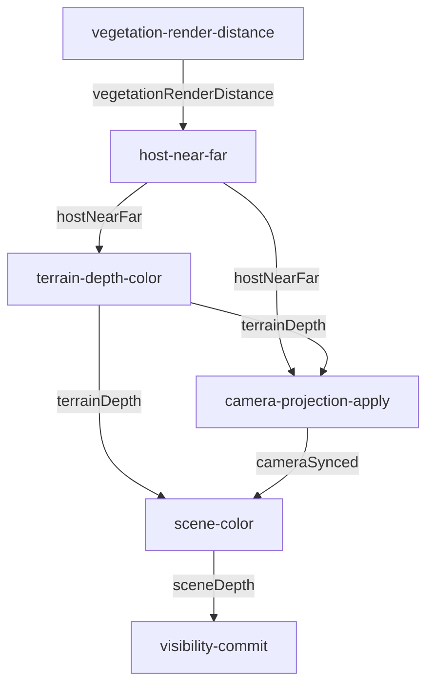

# Rendering: culling and visibility

This document is the culling-unification inventory (`cull-inventory-doc`). It covers every
system that decides whether something drawable is actually drawn this frame, in one table, so a
future change can be gauged against the whole picture instead of one file at a time.

## Culling/visibility systems

| System | File:line | Candidate set | Budget/frame | Hysteresis policy | Fail-open policy |
|---|---|---|---|---|---|
| TerrainOcclusion | `client/core/TerrainOcclusion.js` | Terrain quadtree leaves (mapspinner, host-side raw WebGL2) | GPU-time-scaled via `OcclusionQueryBudget` (0 below 6ms frame time, ramps 24-96 total ceiling up to 20ms, own default 32 only when the arbiter is absent) | `OcclusionPolicy`: hideStreak=2, unhideStreak=1 (immediate un-cull) | eyeAtIssue distance expiry (min 3m, x1.5 record size) + rebuild-staleness (stop query after 8 frames unseen, fail open after 16) |
| SceneOcclusion | `client/core/SceneOcclusion.js` (wraps `packages/streaming-gltf` `OcclusionQueryTier`) | Vegetation/rock/grass chunk box-proxies | GPU-time-scaled via `OcclusionQueryBudget` (own default 16 only when the arbiter is absent) | `OcclusionPolicy`: hideStreak=2, unhideStreak=2 (symmetric, budget-starvation-safe) | stale-resolve fail-open (90 frames without a fresh resolve) + anomaly-fraction guard (see below) |
| ModelPoolAdapter / ModelPool occlusion tier | `client/ModelPoolAdapter.js` wraps `packages/streaming-gltf/src/model-pool.js`'s internal `OcclusionQueryTier` | ModelPool entity roots (hero/mid tier models) | GPU-time-scaled via `OcclusionQueryBudget` (own default 32 via `occlusionMinCandidates` only when the arbiter is absent) | None (vendored tier is fail-open-only, no streak hysteresis) | Two-frame latency fail-open only (unresolved candidate stays visible); no eyeAtIssue/staleness/anomaly guard today |
| mapspinner occlusionPredicate | `packages/mapspinner/src/planet-orchestrator.js:927,937` | Same terrain leaves as TerrainOcclusion (this is the CONSUMER of TerrainOcclusion's verdicts, issued post-render) | N/A (pure read, no query issue here) | N/A (delegates entirely to TerrainOcclusion's own hysteresis) | N/A |
| InstancedMesh2 / ClusterLodMesh BVH frustum cull | `packages/streaming-gltf/src/cluster-lod-mesh.js` (`onBeforeRender`) | Mesh clusters within one `ClusterLodMesh` | N/A (CPU bounding-AABB test per cluster per frame, not query-based) | Screen-size-based LOD pick with hysteresis (separate from occlusion) | N/A (frustum cull only, no occlusion fail-open needed) |
| EntityLoader distance cull | `client/EntityLoader.js:125` `updateVisibility` | All non-ModelPool entity meshes | N/A (flat per-mesh distance check every call) | None (hard cutoff, no streak) | `userData.isModelPool` tag skips this cull entirely for ModelPool-routed roots (see `modelpool-legacy-visibility-cull-vs-pool-lod` caveat) -- ModelPool manages its own distance/LOD internally |
| Remote-player distance cull | `client/app.js` animate() loop (owned by RenderGraph migration, out of this scope) | Remote player avatars | N/A | N/A | N/A |
| LOD hysteresis bands (vegetation/rocks/grass) | `client/core/Vegetation.js`, `Rocks.js` | Same candidates as SceneOcclusion, different concern (LOD tier, not occlusion) | N/A | Bitmask LOD bands with hysteresis (separate system, see `veg-lod-bands-bitmask` caveat) | N/A |
| Shadow LOD gates | shadow-move gate in `client/app.js` animate() loop (owned by RenderGraph migration, out of this scope) | Shadow-casting geometry | N/A | Temporal throttle (not per-candidate hysteresis) | N/A |

## Shared infrastructure (this session)

- **`client/core/OcclusionPolicy.js`** -- the ONE shared verdict-policy module. TerrainOcclusion.js
  and SceneOcclusion.js both consume it; only their config objects differ (see each file's own
  header comment for why each differing constant is deliberate, not drift). Owns: streak-based
  hide, symmetric-or-immediate unhide streak, eyeAtIssue distance expiry, stale-resolve fail-open,
  rebuild-staleness fail-open, anomaly-fraction batch guard. Does NOT own GPU query issue/resolve
  mechanics -- each consumer still owns its own query submission.

- **`client/core/OcclusionQueryBudget.js`** -- the shared per-frame GPU query-issue budget arbiter
  across TerrainOcclusion, SceneOcclusion, and ModelPool's tier (three previously-uncoordinated
  issuers). GPU-TIME-DRIVEN (not candidate-count-driven): `reportFrameTime(ms)` feeds the real
  last-completed-frame cost (`window.__perf.lastMs` from `client/core/FrameMetrics.js` -- the only
  GPU-time estimate this client has; no `EXT_disjoint_timer_query` GPU timer exists anywhere in the
  codebase). Below `fastFrameSkipMs` (default 6ms) every consumer is allocated 0 -- occlusion
  queries are SKIPPED ENTIRELY, since they cost real GPU time (beginQuery/drawElements/endQuery
  driver round-trips) that is pure waste when the frame already has headroom. From `fastFrameSkipMs`
  up to `slowFrameMs` (default 20ms) the total combined ceiling ramps linearly from `minTotalBudget`
  (24) to `maxTotalBudget` (96), capped at `maxTotalBudget` beyond that -- a slower frame gets a
  bigger query budget because more aggressive culling is worth its own GPU cost when there is more
  draw-call/vertex cost to cull away. Candidate count still decides the PER-CONSUMER split of
  whatever total the frame-time gate grants (`reportCandidates`), it no longer decides IF queries run
  or the overall ceiling. Wired live in `client/core/RenderGraph.nodes.js`'s `visibility-commit`
  node: `reportFrameTime` is called once per frame in `client/app.js`'s `animate()` (before
  `renderGraph.run`), `apply()`/`reportCandidates()` run per-consumer inside the node, immediately
  before/after each consumer's own query pass. `getStats()` exposes `{frameMs, totalBudget, skipped,
  consumers: {name: {candidates, allocated}}, ...}` -- read via `window.__occlusionQueryBudget.getStats()`
  or `window.__culling.aggregate().occlusionQueryBudget`.

- **`client/core/CullingHub.js`** -- `window.__culling.aggregate()` reads every registered system's
  `getStats()` and sums/maxes them into one health snapshot. Uniform stats shape
  (`cull-stats-uniform-shape`), now emitted by every system's `getStats()`:
  ```
  { candidates, queriedThisFrame, resolved, occluded, failOpens, anomalyTrips, flips, oldestPendingFrames }
  ```
  `oldestPendingFrames` aggregates as MAX across systems (a worst-case pending age), every other key
  sums.

- **`client/core/OcclusionQueryVisualizer.js`** -- `window.__occlusionQueryDebug`, a ColliderDebug.js-
  style toggleable overlay drawing every registered consumer's candidate AABBs, color-coded by
  verdict state (visible=green, occluded=red, pending=yellow, failed-open=cyan,
  anomaly-skipped=magenta). Each consumer exposes `getDebugBoxes()`; the visualizer's
  `registerProvider(name, fn)` wires them in. Wiring the toggle hotkey + per-frame `update()` call
  into app.js/the editor is owned by sibling scopes (RenderGraph wiring / inspector UI) -- this file
  is the ready-to-wire primitive, same split as the budget arbiter above.

## The false-occlusion bug (cull-false-occlusion-root-cause)

See the root-cause section below once live investigation completes this session. SceneOcclusion's
`ANOMALY_FRACTION` stopgap (default 0.30) and its own code comments documenting the bug's
unresolved status are preserved verbatim in `client/core/SceneOcclusion.js`'s header comments
pending that investigation's outcome.

## Node contract (`client/core/RenderGraph.js`)

The client's per-frame update+render passes run through one DAG orchestrator,
`createRenderGraph(nodes, opts)`, built from an array of node objects and driven each frame by
`graph.run(ctx)`. This section documents the real, already-implemented contract; see
`client/core/RenderGraph.js`'s own header comment for the canonical source and
`client/core/RenderGraph.nodes.js` for the shipped render-section nodes (host-near-far ->
terrain-depth-color -> camera-projection-apply -> scene-color -> visibility-commit).

**Node shape**

```
{
  id: string,                // unique; shows in inspector/errors/mermaid
  reads: string[],           // resource keys consumed -- edges derive from these
  writes: string[],          // resource keys produced -- EXACTLY ONE writer per key, enforced
  shouldRun?: ctx => bool,    // false = skip this frame
  required?: true,           // refuses disable() (e.g. scene-color: a frame must draw)
  independent?: true,        // opts out of the implicit registration-order edge
  run: ctx => void,          // the pass body; writes go to ctx.res[key]
}
```

**Single-writer-per-resource invariant.** Enforced at graph *construction*, not at runtime: while
walking the node list, `createRenderGraph` builds a `writerOf` map keyed by resource, and if a
second node declares the same key in its `writes[]`, it throws immediately --
`` RenderGraph: '${key}' written by both '${a}' and '${b}' -- every resource must have exactly one
writer ``  (`client/core/RenderGraph.js:38-46`). This is what makes an ad-hoc extra
depth-compositing/writer path structurally impossible to add without either reusing the existing
writer node or the graph refusing to build.

**Marker resources (order-only edges).** A resource can be read purely to force ordering, with its
value never inspected by the reader -- e.g. `camera-projection-apply` reads `terrainDepth` as a
second dependency alongside `hostNearFar`, but only ever touches `ctx.res.hostNearFar` in its body
(`client/core/RenderGraph.nodes.js:88-101`); the `terrainDepth` read exists solely so
`camera-projection-apply` is topologically ordered after `terrain-depth-color`. Any resource key
can be used this way -- the graph builder derives edges from `reads`/`writes` name-matching alone
and never inspects `ctx.res` values while building the order.

**Implicit sequential edge.** A node whose `reads[]` is empty would otherwise have in-degree 0 and
could run in the first Kahn's-algorithm batch regardless of registration position. To keep
"registration order is the fallback ordering" true in practice, every node that is not marked
`independent: true` gets an implicit order-only dependency on the immediately-preceding registered
node (unless a real data edge already covers that ordering) -- see
`client/core/RenderGraph.js:70-84`. Ties in the resulting topological sort break FIFO, reproducing
today's real `animate()` execution order when declared edges match today's real dependencies.

**Skip semantics.** When a node's `shouldRun(ctx)` returns false, the node is skipped for that
frame (`stats.skips++`) and its `run` never executes -- so every resource it would have written to
`ctx.res` simply keeps **last frame's value**, or stays `undefined` on frame 1 (`ctx` is a
persistent object app.js reuses across frames; `ctx.res` is never reset between runs). Downstream
nodes that read such a resource must tolerate both a stale prior value and `undefined`. Example:
`host-near-far` and `terrain-depth-color` both gate on `shouldRun: ctx => !!ctx.terrainBackdrop`
(`client/core/RenderGraph.nodes.js:45,69`) -- when there is no terrain backdrop yet, `hostNearFar`
and `camera-context` simply hold whatever they held the previous frame they did run, and
`camera-projection-apply` (itself gated the same way) is likewise skipped rather than consuming a
stale value.

**Error policy.** A node whose `run` throws is caught per-frame: the error is logged once per node
id (`console.error`, named), the remainder of that frame's nodes are skipped, and the next frame
runs normally (`client/core/RenderGraph.js:115-121,186-192`) -- a half-written frame does not
cascade into a permanently broken graph.

**Disable/enable.** `window.__renderGraph.disable(id)`/`enable(id)` toggle a node off/on live for
bisection; a disabled node follows the exact same skip semantics as a `shouldRun`-false node
(`stats.skips++`, resources hold last value). Nodes marked `required: true` refuse `disable()`.

## The two graphs

There are two separate `createRenderGraph` instances, not one:

- **Render graph** (`client/app.js:844`, `createRenderGraph(buildRenderSectionNodes())`) -- built
  with default options, so it self-exposes as `window.__renderGraph`. This is the ONLY graph with a
  live mermaid/inspector surface. 6 nodes: the terrain-depth/color/camera-sync/scene-draw/occlusion
  pipeline.
- **Frame graph** (`client/app.js:1024`, `createRenderGraph(buildFrameSectionNodes(), { expose: false })`)
  -- explicitly opts OUT of `window` exposure (`expose: false`), so it has no `toMermaid()`/inspector
  access from the page. 8 nodes: the per-frame update pipeline (clock, scene-graph tick, app
  dispatch, UI, camera/input, culls, shadow gate, foliage, editor-frame update).

Both run every animation frame, in this order: frame graph first (game/update logic), then render
graph (draw). `window.__renderGraph` refers to the render graph only -- the frame graph's nodes are
documented below from source since there is no live equivalent to query.

## Render graph: generated mermaid graph

`window.__renderGraph.toMermaid()` (`client/core/RenderGraph.js:159-169`) generates this
deterministically from the live node list + resolved writer-per-key map -- one `id["id"]` line per
node in topological order, then one `producer -- key --> consumer` edge line per real (non-marker,
non-self) read/writer pair. A prior session live-witnessed this exact method returning a 743-char
flowchart with this same shape (`insp-dot-export`, `.gm/prd.yml`); no live browser session was
available to this pass (see "How this graph was produced" below), so the graph below is derived by
hand-tracing the identical algorithm against the current `client/core/RenderGraph.nodes.js` source
-- same deterministic construction, same output `toMermaid()` would print right now, given the
graph has exactly one legal topological order (registration order; every implicit predecessor edge
below is already subsumed by a real data edge, so no tie-break ever triggers).



**How this graph was produced.** This pass had no live `browser`-style tool available (only a
static-content web fetcher, no page/JS execution capability), and port 8090 on this machine was
already live with multiple established connections at the time -- almost certainly another
concurrent session's editor/browser work (see `one-server-two-client-modes-same-origin` in
AGENTS.md), and colliding with an in-use live session was judged an unacceptable risk rather than a
green light to hijack it. So this graph is NOT a pasted live `toMermaid()` capture; it is
hand-derived by literally re-running `toMermaid()`'s own construction algorithm (dedup-by-producer
read-scan, `client/core/RenderGraph.js:38-84,159-169`) against the current
`buildRenderSectionNodes()` source, which is the same deterministic input the live method would
consume. **To get a byte-exact live capture**, open the app (`?singleplayer&world=tps-game`) and
run `window.__renderGraph.toMermaid()` in the page console, or open the RenderGraph inspector
window and use its "copy mermaid" affordance if present -- the live string is always the ground
truth over this hand-derivation if the two ever disagree (e.g. after a future node is added here
without updating this doc).

## Node table

### Render graph (`client/core/RenderGraph.nodes.js`, `buildRenderSectionNodes()`)

| id | purpose | reads | writes | file:line |
|---|---|---|---|---|
| `vegetation-render-distance` | Computes THREE's camera-far floor as the max of vegetation/rocks/grass render distances (+15% margin, 100m floor) -- independent of mapspinner's own terrain-horizon far plane. | (none) | `vegetationRenderDistance` | `client/core/RenderGraph.nodes.js:17-30` |
| `host-near-far` | Derives THREE's wanted near/far from last frame's planet near/far + the vegetation-distance floor, capped at distance-to-planet-center; publishes `window.__hostNearFar` before mapspinner's `renderPlanet` reads it synchronously during depth-writeback re-encode. Skipped entirely with no terrain backdrop. | `vegetationRenderDistance` | `hostNearFar` | `client/core/RenderGraph.nodes.js:41-60` |
| `terrain-depth-color` | Calls mapspinner's unchanged `renderPlanet()`, then captures the globals mapspinner publishes (`window.__planetNearFar`, `window.__lastVP`, `window.__lastGLCam`) into `ctx.res` once so downstream nodes read `ctx.res` instead of `window.*`. Skipped entirely with no terrain backdrop. | `hostNearFar` | `camera-context`, `terrainDepth`, `terrainColor` | `client/core/RenderGraph.nodes.js:65-83` |
| `camera-projection-apply` | Applies the pre-computed near/far to THREE's camera (`updateProjectionMatrix()`) only if changed, after `renderPlanet` ran. `terrainDepth` read is an order-only marker (value never used). Skipped entirely with no terrain backdrop. | `hostNearFar`, `terrainDepth` (marker) | `cameraSynced` | `client/core/RenderGraph.nodes.js:88-101` |
| `scene-color` | `renderer.render(scene, camera)` -- the actual THREE draw call, depth-testing against whatever `terrain-depth-color` left in the canvas depth buffer. `required: true` (disable() refused): a frame must draw. | `terrainDepth`, `terrainColor`, `cameraSynced` | `sceneDepth`, `sceneColor` | `client/core/RenderGraph.nodes.js:106-119` |
| `visibility-commit` | Issues+resolves fresh occlusion queries (ModelPool, terrain backdrop, SceneOcclusion) against the now-final depth buffer; results apply next frame. Preserves the exact modelPool -> terrainBackdrop -> sceneOcclusion call order the pre-graph `animate()` used. | `sceneDepth` (marker) | `occlusionCommitted` | `client/core/RenderGraph.nodes.js:123-133` |

### Frame graph (`client/app.js`, `buildFrameSectionNodes()`)

| id | purpose | reads | writes | file:line |
|---|---|---|---|---|
| `frame-clock` | Computes clamped frame delta-time, flips frame-parity bit, feeds `runtimeStats`/FPS counters, samples the optional leak-probe snapshot, derives lerp factor from RTT, caches `client.playerId` and the editor xstate snapshot once per frame (was being re-derived up to 4x/frame). | (none) | `frameDt`, `isEditorFrame`, `lerpFactor`, `localId` | `client/app.js:862-900` |
| `scene-graph-tick` | Rebuilds the entity hierarchy if dirty, ticks player animators, ticks `sceneGraph` (entity transform lerp), records the replay buffer (skipped in editor frames -- editor fly-cam movement isn't gameplay-relevant), ticks spin/hover animated entities. | `frameDt`, `isEditorFrame`, `localId` | `sceneGraphMoved` | `client/app.js:901-914` |
| `app-dispatch-frame` | Dispatches the per-frame app-module tick (`ams.dispatchFrame`) and facial-animation update. | `frameDt` | `appFrameDispatched` | `client/app.js:915-923` |
| `ui-render` | Throttled (every 0.25s) HUD/stats re-render via `ams.renderAppUI`, only when a snapshot of world state exists. | `frameDt` | (none) | `client/app.js:924-937` |
| `camera-input-update` | Resolves local player state, updates the camera controller (skipped while XR-presenting unless in editor frame), syncs/update XR system, derives the foliage-streaming focus point (fly-cam position while editing, else local player position). | `frameDt`, `isEditorFrame`, `localId` | `localState`, `vegFocus` | `client/app.js:938-951` |
| `remote-player-cull` | Throttled (50ms) distance-cull of REMOTE player avatars only (never the local player, to avoid a reconciliation-spike flicker); visibility radius derives from `worldConfig.relevanceRadius` + margin. | `localId` | (none) | `client/app.js:952-972` |
| `entity-distance-cull` | Throttled (100ms) flat distance-cull via `el.updateVisibility(camera)` for all non-ModelPool entity meshes. `frameDt` read is an order-only marker: a genuinely zero-real-dependency node would otherwise race into the same initial FIFO batch as `frame-clock` and run before frame-dependent nodes it should follow (live-witnessed defect this marker fixes). | `frameDt` (marker) | (none) | `client/app.js:973-982` |
| `shadow-move-gate` | Re-triggers `renderer.shadowMap.needsUpdate` only every 2nd frame OR the frame the shadow target moved past a 0.25m gate -- caps shadow-map re-render (and every InstancedMesh2 BVH cull against the shadow camera) cost while keeping a moving target never more than one frame stale. | `localId` | `shadowMoved` | `client/app.js:983-997` |
| `foliage-update` | Updates ModelPool, then vegetation/rocks/grass (each gated on `window.__terrain` existing). Vegetation's 4th arg (`!shadowMoved`) freezes its own InstancedMesh2/impostor cull only when BOTH camera AND shadow target are still. | `frameDt`, `vegFocus`, `shadowMoved` | (none) | `client/app.js:998-1012` |
| `editor-frame-update` | Editor-only per-frame work: collider-debug overlay update, gizmo update, throttled (100ms) camera-coordinate readout in the edit panel. | `vegFocus` | (none) | `client/app.js:1013-1021` |

## Resource table

Every distinct resource key across both graphs (render graph keys first, then frame graph keys),
writer node, reader node(s), and what the value represents.

| key | graph | written by | read by | description |
|---|---|---|---|---|
| `vegetationRenderDistance` | render | `vegetation-render-distance` | `host-near-far` | THREE camera-far floor (m): max of vegetation/rocks/grass render distances + 15% margin, 100m floor. |
| `hostNearFar` | render | `host-near-far` | `terrain-depth-color`, `camera-projection-apply` | `{near, far}` THREE wants this frame, derived from last frame's planet near/far + vegetation-distance floor, capped at distance-to-planet-center. Also mirrored to `window.__hostNearFar`. |
| `camera-context` | render | `terrain-depth-color` | (none -- debug mirror only; construction-time `written-never-read` warning fires for this key) | Snapshot of mapspinner's published near/far/fovy/aspect/viewProj/eye globals at the moment `renderPlanet` ran, plus `frameId`. |
| `terrainDepth` | render | `terrain-depth-color` | `camera-projection-apply` (marker), `scene-color` | `{near, far, target:'canvas', frameId}` -- marks that the canvas depth buffer now holds mapspinner's terrain depth for this frame. |
| `terrainColor` | render | `terrain-depth-color` | `scene-color` | `{target:'canvas'}` -- marks that the canvas color buffer now holds mapspinner's terrain color for this frame. |
| `cameraSynced` | render | `camera-projection-apply` | `scene-color` | `true` once THREE's camera near/far/projection matrix matches `hostNearFar` for this frame. |
| `sceneDepth` | render | `scene-color` | `visibility-commit` | `{target:'canvas', frameId}` -- marks that the canvas depth buffer now holds the full THREE-scene-composited depth, the buffer occlusion queries must test against. |
| `sceneColor` | render | `scene-color` | (none -- debug mirror only) | `{target:'canvas'}` -- marks that the canvas color buffer now holds the full composited frame. |
| `occlusionCommitted` | render | `visibility-commit` | (none -- debug mirror only) | `frameId` of the last frame occlusion queries were issued+resolved. |
| `frameDt` | frame | `frame-clock` | `scene-graph-tick`, `app-dispatch-frame`, `ui-render`, `camera-input-update`, `entity-distance-cull` (marker), `foliage-update` | Clamped (1ms-100ms) delta-time in seconds since last frame. |
| `isEditorFrame` | frame | `frame-clock` | `scene-graph-tick`, `camera-input-update` | Cached xstate `clientMachine.isEditor` snapshot for this frame (was re-derived up to 4x/frame before caching). |
| `lerpFactor` | frame | `frame-clock` | (none -- consumed via `ctx.res.lerpFactor` read directly in `scene-graph-tick`'s call to `sceneGraph.tick`, not listed in that node's declared `reads`) | Exponential smoothing factor derived from RTT (24 or 16 base rate) and `frameDt`, for entity-transform lerp. |
| `localId` | frame | `frame-clock` | `scene-graph-tick`, `camera-input-update`, `remote-player-cull`, `shadow-move-gate` | `client.playerId`, this client's own player id. |
| `sceneGraphMoved` | frame | `scene-graph-tick` | (none -- debug mirror only) | Return value of `sceneGraph.tick()`: whether any entity transform actually changed this frame. |
| `appFrameDispatched` | frame | `app-dispatch-frame` | (none -- debug mirror only) | `true` once per-frame app-module dispatch + facial animation update ran. |
| `localState` | frame | `camera-input-update` | (none -- debug mirror only) | This client's resolved local player state object for this frame. |
| `vegFocus` | frame | `camera-input-update` | `foliage-update`, `editor-frame-update` | World-space focus point foliage streams around: the editor fly-cam position while editing, else the local player position. |
| `shadowMoved` | frame | `shadow-move-gate` | `foliage-update` | Whether the shadow target crossed the 0.25m re-render gate this frame (also drives vegetation's cull-freeze: frozen only when both camera and shadow target are still). |

Note on `lerpFactor`: it is written to `ctx.res` but not declared in any node's `reads[]` array, so
it produces zero graph edges and is consumed only by direct `ctx.res.lerpFactor` field access
inside `scene-graph-tick`'s own `run` body -- the declared-edge mechanism only covers what a node
lists in `reads`, not everything its closure happens to touch on `ctx.res`.

## Debugging a rendering bug here

A practical sequence for someone unfamiliar with this codebase, using the tools that exist today --
no source reading required unless a step below points you at a specific file:

1. **Open the RenderGraph inspector.** In the editor toolbar, click "RenderGraph" (mounts
   `client/editor/RenderGraphViewer.js`). It renders every render-graph node as a box (label,
   per-node ms/ema, draw-calls/triangles delta, run/skip/error counts, OK/SKIPPING/ERROR/DISABLED
   status word) connected by resource-labelled edges, polled live every 500ms while the window is
   open. If it says "window.__renderGraph is not found," the page hasn't finished booting the
   render graph yet -- reload and retry once the scene is visible.

2. **Read the watchdog log and the always-on culling HUD line.** The inspector's node colors surface
   per-node health, but two lower-level signals catch classes the inspector doesn't visualize
   directly: `window.__renderGraph.watchdogLog` (page console) logs once-per-kind for `nan-camera`,
   `near-ge-far`, and `autoclear-left-false` -- any entry here means a node corrupted shared render
   state and is the single most likely root cause of a visual glitch. Separately, the stats panel's
   `CULL` row (fed by `window.__culling.aggregate()`) is always visible with `showStats` on and
   reads as `CULL occluded/candidates | FAILOPEN n | ANOMALY n` -- a glitch where geometry
   pops/vanishes/never-appears often traces to a spike in one of these three numbers rather than the
   render graph at all.

3. **Bisect with per-node disable.** Click any node box in the inspector to toggle
   `disable(id)`/`enable(id)` live (refused for `required: true` nodes, currently only
   `scene-color`). If disabling a node makes the visual artifact disappear, that node (or something
   it depends on via its declared `reads`) is implicated -- a disabled node's resources simply hold
   last frame's value, so this is a real elimination, not a guess. Work from the artifact backward
   along the edges shown in the inspector rather than disabling nodes at random.

4. **Capture a full frame snapshot for a bug report.** `await window.__renderGraph.capture()` in the
   page console resolves after the next completed frame with one serializable object: node order,
   disabled set, full per-node stats, every `ctx.res` value (primitives/short-numeric-arrays/shallow
   objects verbatim, everything else typed-only), camera position/near/far, renderer draw-call/tri/
   texture/geometry counts, `window.__culling.aggregate()`, and the watchdog log -- paste this
   verbatim into a bug report instead of describing symptoms; it is strictly more information than
   a screenshot plus a paragraph.

5. **Check culling-system health directly.** `window.__culling.aggregate()` sums/maxes every
   registered culling system's `getStats()` into one snapshot: `{candidates, queriedThisFrame,
   resolved, occluded, failOpens, anomalyTrips, flips, oldestPendingFrames}` (the last aggregates as
   MAX, everything else sums). A large `failOpens` or `anomalyTrips` count under a "things pop in/out
   incorrectly" report points at the occlusion-query systems (see the culling inventory table above)
   rather than the render graph proper -- `oldestPendingFrames` climbing without bound means a query
   budget is starved and queries are backing up.

6. **If the bug is in the frame graph (game/update logic, not drawing), there is no live inspector
   for it** -- `buildFrameSectionNodes()`'s graph is constructed with `{ expose: false }` (no
   `window.__renderGraph` equivalent). Fall back to reading `client/app.js`'s `buildFrameSectionNodes()`
   directly (node table above) and reasoning about the declared `reads`/`writes` per node, or add a
   temporary `console.log` inside the suspect node's `run` body.
